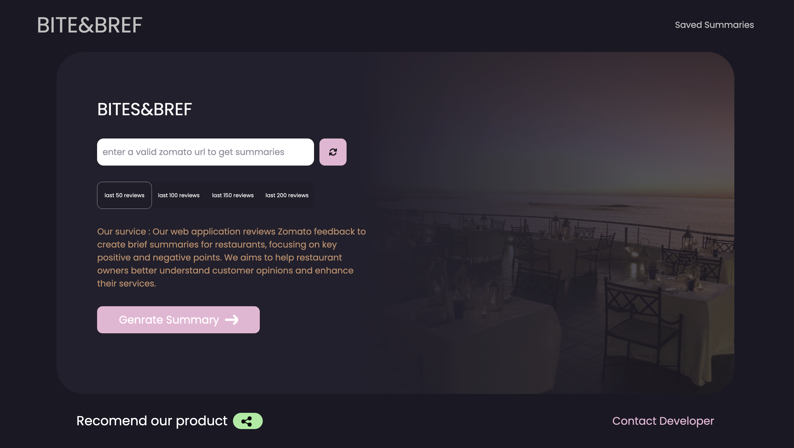
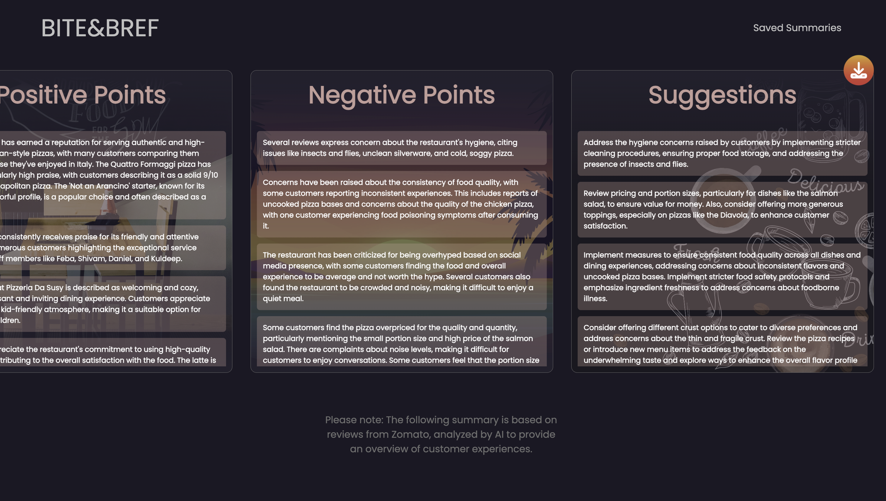
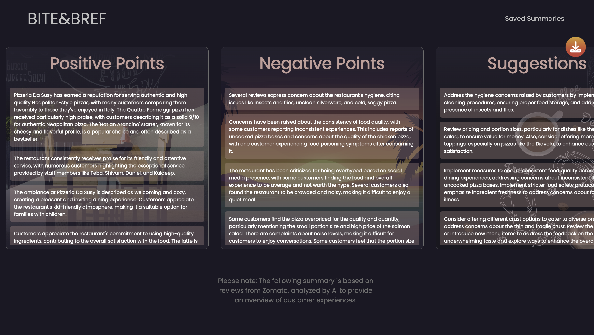
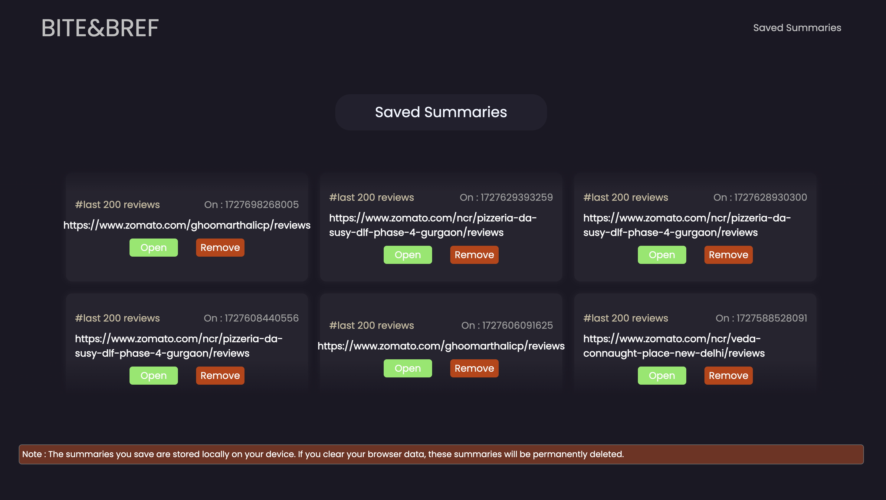

# Restaurant Review Analysis with Graph of Thoughts (GoT)

This project is an AI-powered application designed to analyze restaurant reviews and provide detailed summaries of both positive and negative feedback. The application leverages the **Graph of Thoughts (GoT)** framework, a recent advancement in AI, for more comprehensive and non-linear analysis of user reviews.

## Features
- **Scrapes reviews** from restaurant websites like Zomato using the **Cheerio** library.
- **Graph of Thoughts (GoT) framework** implemented for advanced reasoning and review analysis, offering a **35% improvement** in accuracy and depth over traditional methods.
- **Gemini-1.5-flake** AI model processes the reviews to generate concise, actionable insights.
- **React frontend with Tailwind CSS** for a smooth user experience where users can input a restaurant URL.
- **Node.js backend** acting as an AI agent to handle review scraping, sentiment analysis, and generating final summaries.

## Technologies Used
- **Node.js** for backend development.
- **Cheerio** for web scraping.
- **React** for the frontend.
- **Tailwind CSS** for styling.
- **Graph of Thoughts (GoT)** framework for AI reasoning and analysis.
- **Gemini-1.5-flake** as the foundational AI model.

## example out puts
- example outputs are available in the demo file inside desktop
- the include all the iintermediate thoughts of the AI before giving final output

## UI for URL input

## UI of final summary and for accessing saved summary

